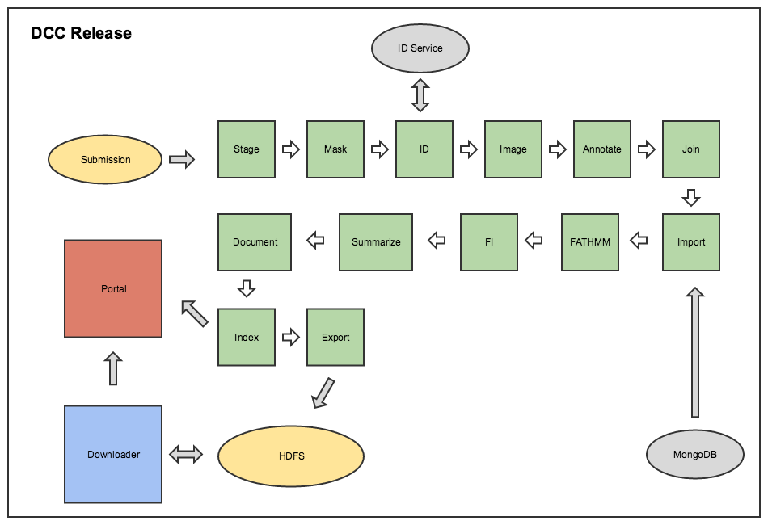

ICGC DCC Release Pipeline Description
===

- [Overview](#overview)
- [Stage Job](#stage)
- [Mask Job](#mask)
- [ID Job](#id)
- [Image Job](#image)
- [Annotate Job](#annotate)
- [Join Job](#join)
- [Import Job](#import)
- [FATHMM Job](#fathmm)
- [Functional Impact Analysis Job](#fi)
- [Summarize Job](#summarize)
- [Document Job](#document)
- [Index Job](#index)
- [Export Job](#export)

##  Overview

This document briefly describes the DCC Release workflow. 

The DCC Release project consumes clinical data [submitted](http://docs.icgc.org/submission/about/) by the users and prepares it to be consumed by the [DCC Portal](https://dcc.icgc.org/). Its source code could be found in the [DCC Portal repository.](https://github.com/icgc-dcc/dcc-portal)

The ETL diagram depicts DCC Release components and their interaction.

*ETL diagram*

ETL project consists of 13 jobs which are executed sequentially to perform various transformations on the submitted data.

##  Stage Job
Reads submission data and uncompresses the data so it becomes compression agnostic.

##  Mask Job
During this step `marking`, `mutation` and `observation_id` fields are added to `ssm_p` files. `sgv_p` files are enriched with `observation_id` field.

Also, Mask Job strips out confidential fields (replaced with empty string) based on dictionary when 'filter_controlled' option is used

##  ID Job
The job generates/assigns stable Identifiers for major entities, such as, `Donor`, `Specimen`, `Sample`, `SSM mutation`.

##  Image Job
The job linkout(s) specimens to digital image of a stained section, demonstrating a representative section of tumour.

##  Annotate Job
Annotate job is responsible for annotating the variant with SO terms and predicts the effects of variants on genes (such as amino acid changes) from `ssm_p` and `sgv_p` files. Internally it uses [SnpEff project](http://snpeff.sourceforge.net/) to do this job.

##  Join Job
Join job performs joins of clinical data (donor/specimen/sample), and each of the experimental data types.

##  Import Job
Import Job imports reference data such as projects, go, genes, CGC and pathways data from the reference database. The data is used to enrich documents loaded to the ElasticSearch cluster.

##  FATHMM Job
FATHMM job performs Functional Analysis through Hidden Markov Models (FATHMM). More detailed information could be found in the [FATHMM documentation](FATHMM.md).

##  Functional Impact Analysis Job
The job performs mutation functional impact analysis. More documentation could be found in the [DCC documentation](http://docs.icgc.org/portal/methods/#mutation-function-impact-prediction).

##  Summarize Job
Summarize job generates different metrics on various entities such as:

- Available observation types for a donor.
- What age group a donor belongs to?
- Number of donors in a particular project.
- Number of mutations for a project.

etc.

##  Document Job
Document job reads the documents prepared by the previous step as well as the reference data, transforms the normalized documents into ElasticSearch documents for indexing into an ElasticSearch cluster.

[Simple somatic mutation aggregated data](https://dcc.icgc.org/releases/current/Summary) is produced at this step.

##  Index Job
Index job load the ElasticSearch documents prepared by the Document job in an ElasticSearch cluster.

##  Export Job
Export job prepares the documents produced by the Join job to be consume by the DCC Download service. The files are available for download on the [DCC Portal](https://dcc.icgc.org/releases).

The job separates required files to `open access` available to public and `controlled access` which are available only to those approved by the [DACO office](https://icgc.org/daco).

