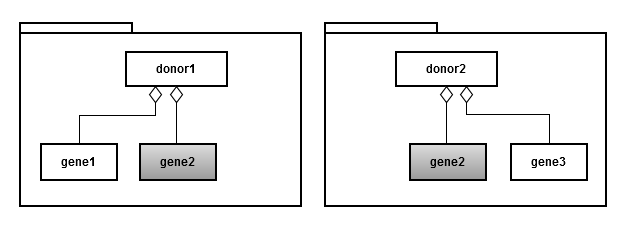
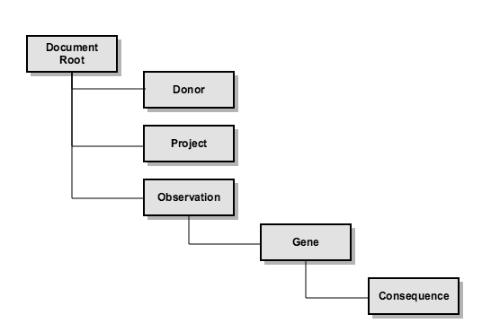

Elasticsearch schemas
===

*NOTE:* Schema files compatible with [JSON Schema](http://json-schema.org/) are located [here](src/main/resources/org/icgc/dcc/release/resources/schemas).

## Overview of Portal Data Types

This page shows the ER diagram of the major portal entities and relations among them.

For conciseness, we present the data model here at more abstract level as below:

## Expose Portal Data via ElasticSearch Indices

Each Elasticsearch (ES) index type can be seen as a denormalized version of the above relational data model. ES does not support joins in the traditional RDBMS sense. When querying data entities that are related to each other, one way to simulate a join is to embed one entity under one another (i.e. nested documents / sub-documents). This is similar to materialized view in the relational database world. The intent is to trade search time for storage space.

Denormalization will introduce redundant sub-documents, for example, when embedding `Gene` under `Donor`, the same `Gene` entry will be repeated under different `Donors`:

As a result, record counts (and facet counts) will not be correct for sub-documents (`Gene` document in this given example), only that for root document (`Donors`) is correct. For that reason, we need to build different types of ES indices, one index uses one of the entity types (i.e., `donor`, `gene` or `observation`) as root.

Elasticsearch allows a query to have restrictions (filtering criteria) on properties of the root document and its embedded sub-documents, the result consists of root documents that fulfill those criteria. Please note an important limitation with regard to the sub-documents: when a root document is returned, all of its embedded sub-documents will also be returned. Furthermore, ES does not tell us which of the embedded documents matched the original criteria applied to them. 

In our case, in order to get matched donors, genes and observations (with their individual facet counts), it's necessary to fire multiple queries one for each index type. Elasticsearch has [REST API](https://www.elastic.co/guide/en/elasticsearch/reference/current/search-multi-search.html) that takes multiple searches in one request, we may take advantage of this feature if it's useful.

## ElasticSearch Index Structures

Description of Elasticsearch types which contain other entity models is described in the subsequent paragraphs.

Following type naming conventions is established in naming of Elasticsearch index types:

- *entity name* - the type stores data for the entity pages. For example, `Donor` type stores all information about a [donor](https://dcc.icgc.org/donors/DO222843).
- *entity-centric name* - the type is used for the [Advanced Search](https://dcc.icgc.org/search) page and the [Data Analysis](https://dcc.icgc.org/analysis/sets) feature.
- *entity-text name* - the type contains metadata about an entity and is used by the `Keyword Search` feature.

#### Donor-Centric Elasticsearch type

#### Gene-Centric Elasticsearch type

#### Mutation-Centric Elasticsearch type

#### Observation-Centric Elasticsearch type

